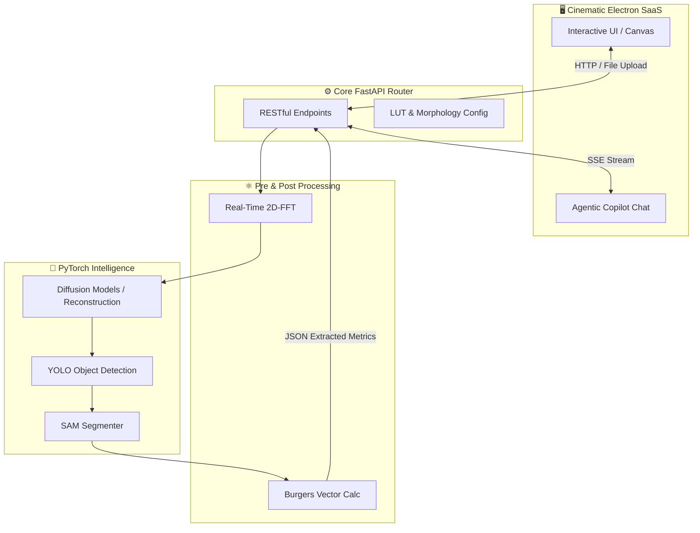
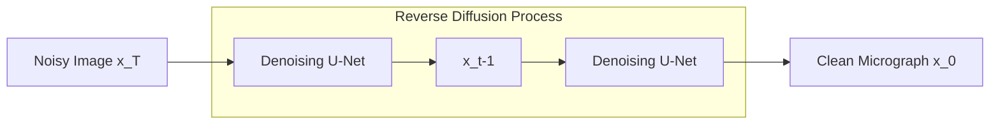

<div align="center">
  
  # TEM AI Studio
  
  **The Next-Generation SaaS OS for Crystallographic Analysis & Electron Microscopy**

  <p>
    <em>Developed as a Machine Learning Research Intern at <strong>IISc Bangalore (2026)</strong></em>
  </p>

  <p>
    <a href="https://react.dev/"></a>
    <a href="https://www.electronjs.org/"></a>
    <a href="https://pytorch.org/"></a>
    <a href="https://fastapi.tiangolo.com/"></a>
    <a href="https://www.gnu.org/licenses/agpl-3.0"></a>
  </p>

  <p>
    <em>Diffusion Models | Agentic AI Copilot | Real-Time Fourier Analysis | Cinematic UI </em>
  </p>
</div>

<hr />

## 📖 Table of Contents
- [About The Project](#-about-the-project)
- [Visual Impact: Before vs. After](#-visual-impact-before-vs-after)
- [The Mathematics & Physics Engine](#-the-mathematics--physics-engine)
- [System Pipeline & Architecture](#-system-pipeline--architecture)
- [Deep Dive: Core Modules](#-deep-dive-core-modules)
- [Getting Started](#-getting-started)

---

## 🌟 About The Project

**TEM AI Studio** is a premium, desktop-grade SaaS application designed to revolutionize how materials scientists and physicists analyze S/TEM (Scanning/Transmission Electron Microscopy) micrographs. 

Built with an Awwwards-quality cinematic UI, the studio bridges the gap between traditional physics (Fourier transforms, defect density calculations) and cutting-edge **Generative AI**. By utilizing highly fine-tuned **Diffusion Models**, YOLO detection logic, and Agentic Large Language Models, it automates hours of tedious crystallographic analysis into mere seconds.

---

## 📸 Visual Impact: Before vs. After

*Drag and drop your own images into the GitHub editor to replace these placeholders.*

| 📉 Traditional S/TEM Micrograph | 📈 TEM AI Studio Reconstruction |
|:---:|:---:|
|  |  |
| *Raw, noisy lattice fringe image with poor contrast. Defects are virtually indistinguishable to the human eye.* | *Diffusion-denoised, perfectly segmented lattice anomalies. Defects isolated and masked instantly by AI.* |

---

## 🧮 The Mathematics & Physics Engine

TEM AI Studio is built upon rigorous physics and mathematical modeling to ensure research-grade accuracy.

### 1. 2D Fast Fourier Transform (2D-FFT)
To analyze periodic lattice structures, the image is transformed from the spatial domain to the frequency (reciprocal) domain:

$$
F(u,v) = \sum_{x=0}^{M-1} \sum_{y=0}^{N-1} f(x,y) e^{-j 2\pi \left(\frac{ux}{M} + \frac{vy}{N}\right)}
$$

Users can interactively mask specific diffraction spots in this domain and apply an Inverse-FFT ($$F^{-1}$$) to reconstruct filtered lattice planes.

### 2. Denoising Diffusion Probabilistic Models (DDPM)
Raw TEM images suffer from severe shot noise and astigmatism. We use Diffusion Models to synthetically clean the micrographs.
The reverse diffusion step learns to recover the clean data distribution $$x_0$$ from noise:

$$
p_\theta(x_{t-1} | x_t) = \mathcal{N}(x_{t-1}; \mu_\theta(x_t, t), \Sigma_\theta(x_t, t))
$$

This allows the AI to "hallucinate" the missing structural integrity of atoms hidden under extreme noise profiles.

### 3. Crystallographic Morphology & LUT Generation
To generate the Look-Up Table (LUT) datasets for FCC and BCC lattice structures, the engine natively computes diffraction conditions using fundamental crystallographic equations:

- **Weiss Zone Law**: Ensures a plane $(hkl)$ belongs to the zone axis $[uvw]$:
  $$
  hu + kv + lw = 0
  $$

- **Interplanar Spacing (Cubic Systems)**: Used to calibrate scale and theoretical lattice parameters ($a$):
  $$
  d_{hkl} = \frac{a}{\sqrt{h^2 + k^2 + l^2}}
  $$

- **Angle Between Planes**: Derived dynamically to match experimental diffraction spots:
  $$
  \cos \theta = \frac{h_1 h_2 + k_1 k_2 + l_1 l_2}{\sqrt{h_1^2 + k_1^2 + l_1^2} \sqrt{h_2^2 + k_2^2 + l_2^2}}
  $$

### 4. Burgers Vector & Invisibility Criterion ($\vec{g} \cdot \vec{b}$)
For dislocations detected by the YOLO/SAM core, the magnitude and direction of the lattice distortion are analyzed using standard defect physics. 
To map dislocation visibility against reciprocal lattice vectors ($\vec{g}$), the AI assesses the fundamental invisibility criteria:

$$
\vec{g} \cdot \vec{b} = 0 \quad (\text{Screw Dislocation Invisibility})
$$

$$
\vec{g} \cdot (\vec{b} \times \vec{u}) = 0 \quad (\text{Edge Dislocation Invisibility})
$$

Where $\vec{u}$ is the line direction. The actual continuous lattice distortion is modeled via the Burgers circuit:

$$
\vec{b} = \oint_C \frac{\partial \vec{u_{disp}}}{\partial s} ds
$$

---

## ⚙️ System Pipeline & Architecture

The system utilizes a decoupled, highly-performant architecture. 



---

## 🧩 Deep Dive: Core Modules

### 1. The Inference Core (Diffusion Architecture)

Our image reconstruction pipeline leverages a custom U-Net based Diffusion Model specifically trained on crystallographic defects:



Once reconstructed, the image is passed into a cascading detection pipeline:
- **YOLO Detector:** Identifies bounding boxes of lattice anomalies.
- **SAM (Segment Anything Model):** Generates pixel-perfect masks for isolated defects.
- **SAHI (Slicing Aided Hyper Inference):** Ensures nano-scale anomalies are detected in multi-megapixel scans.

### 2. Nemotron Agentic Copilot
Data is fed into an embedded **Agentic AI** powered by NVIDIA's `Llama-3.3-Nemotron`. 
- **Context-Aware:** The AI inherently knows the material system, g-vector, and zone axis you are analyzing.
- **UI Control:** The AI can actively trigger UI actions on your behalf (e.g., turning on measurement tools or plotting graphs) by streaming specialized JSON payloads.

---

## 🚀 Getting Started

### Prerequisites
* Node.js (v18+)
* Python (3.10+)
* `pip` and `npm`

### Installation

1. **Clone the repository**
   ```bash
   git clone https://github.com/your_username/TEM-AI-Studio.git
   cd TEM-AI-Studio
   ```

2. **Set up the Backend (FastAPI)**
   ```bash
   pip install fastapi uvicorn python-dotenv opencv-python slowapi openai pydantic
   # Ensure you create a .env file with your NVIDIA_API_KEY and OPENROUTER_API_KEY
   python src/api_server.py
   ```

3. **Set up the Frontend (Electron/React)**
   ```bash
   cd saas_app
   npm install
   npm run electron:dev
   ```

---

<div align="center">
  <i>Designed for Materials Scientists.</i>
</div>
